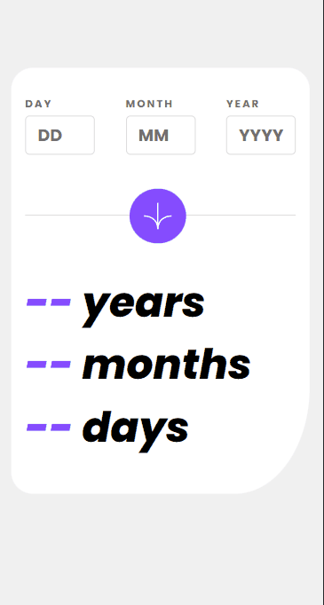

<h1 align="center"><strong>Age-Calculator-App</strong><h1>

    

  

# **Sobre o Projeto**
Projeto <strong>Age-Calculator-App</strong> disponibilizado por [Frontend Mentor](https://www.frontendmentor.io/home) feito utilizando grid layout, flexbox, responsividade, mobile first e a API(momentjs).   
  

# **Tecnologias**
* [HTML](https://developer.mozilla.org/pt-BR/docs/Web/HTML) 
* [CSS](https://developer.mozilla.org/pt-BR/docs/Web/CSS)
* [JavaScript](https://developer.mozilla.org/pt-BR/docs/Web/JavaScript)
* [API](https://developer.mozilla.org/pt-BR/docs/Glossary/API)
  

# **Status**

</img>  

# **Licença**
 </img>  

# **Autor**
<a href="https://www.linkedin.com/in/pedrohalves/">
    </img>
LinkedIn</a>  

# **Disponível**
Clique <a href="https://pedrohenriquealvesfernandes.github.io/age-calculator-app/" style="color: cyan" target="_blank"><strong>AQUI</strong></a> para acessar a projeto em funcionamento (resolução a ser exibida 1366px (desktop) e 375px (celular) ).
